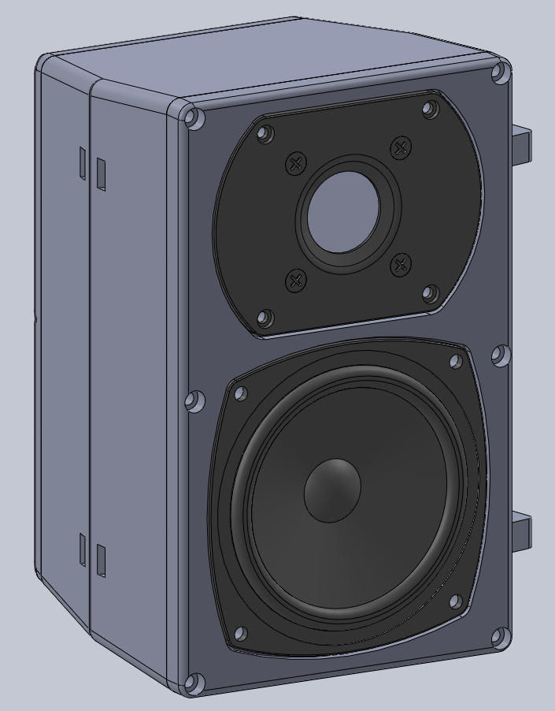
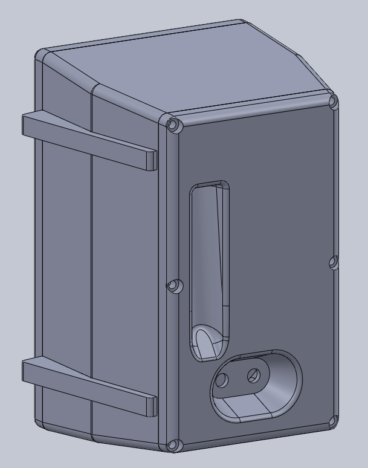
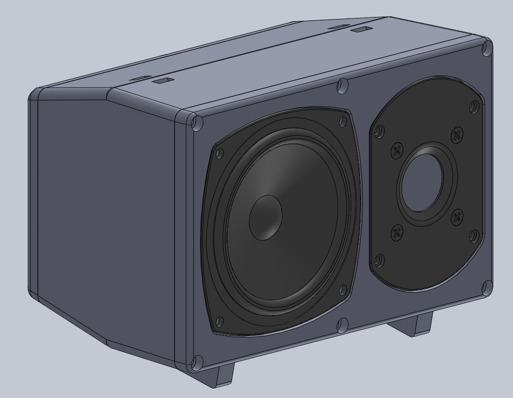
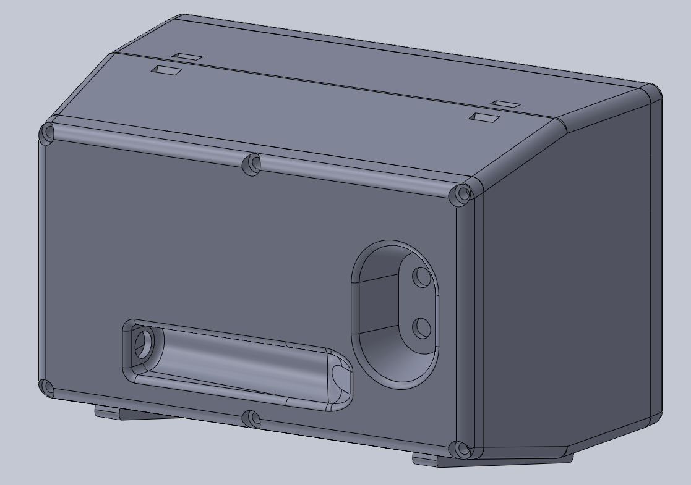

# Custom Repurposed Speakers!
  
  

## Features:
- 4.5" 8 ohm woofers
- 1" 8 ohm tweeters
- YLY 2088 crossovers 
- either (or both!) 1/4" jack, 5-way binding post inputs (generic jacks and plugs, reused posts from towers)
- included "stands" for horizontal mounting
- all .STEP files

## Needed Parts:
- m4\*8 bolts (x40)
- m4\*6\*6 heat inserts (x40)
- m3\*6 bolts (x8)
- m3\*5\*5 heat inserts (x8)

## Overview:
When dead amps in a pair of Definitive Technology BP7006 towers left me with ample (lol) crackle and no bass, I figured why not use the remaining perfectly functional drivers? So I tore the towers apart, only to discover through some online digging that the subs were practically useless at something like 36 ohms - way too much for most budget modern amps. So I scrapped the woofers but kept all 4 woofers and tweeters, enough to make 2 pairs of speakers!

To the audiophiles bound to get upset at this design, no I wasn't going for perfect sound and flat EQ - this was a salvage project to use what I had and make something functional that would be better than integrated TV and monitor speakers (a very low bar). But, they are dense rigid, and sealed, so they work well enough for me.

Additional note: the documentation for the YLY 2088 crossovers is... nonexistent. I wouldn't particularly recommend them, but they are cheap and get the job done. The only info I could find is [here (local copy)](images/YLY2088_datasheet.pdf) (source: https://www.hadex.cz/spec/q619.pdf).
